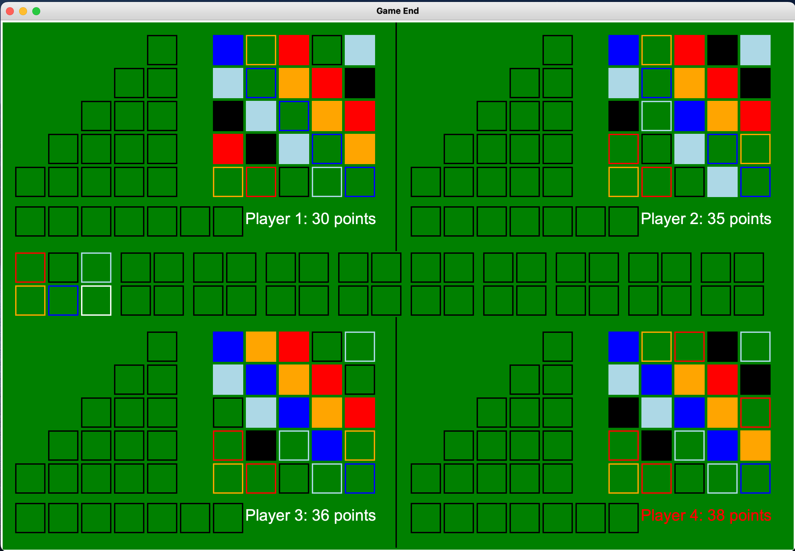
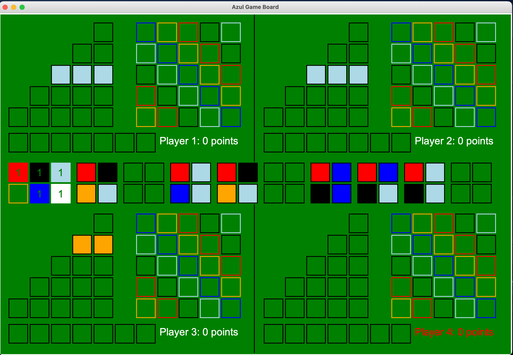

# azul-board-game

## Project Description

This project is a Python-based simulator for the popular board game "Azul." Azul is a tile-laying game designed by Michael Kiesling, where players compete to create beautiful mosaics by strategically selecting and placing tiles.

The simulator provides a graphical user interface (GUI) to replicate the Azul game board, allowing users to play the game against other players.

The goal of this project was to work on my python skills and showcase my ability to implement the complex board game logic along with a GUI to enable smooth game play.

### Features

- Interactive Game PLay: Enjoy the game of Azul with an interactive GUI.

- Multi-Player: 2-4 players can play the game together.

## How to

Make sure you have python3 downloaded on your machine. We use the graphics library tkinter which is usually downloaded with python3.

Run `python3 azul.py` to start the program. Once started, the program will ask for the number of players and the names of the players.

Once the GUI has started you will be able to select tiles from the display and place those tiles on to the pattern line with your cursor.

## Quick Rules

For the full instructions look up the game rules online. I will provide a quick explanation of the game below.

### Objective:

The main objective of Azul is to score the most points by strategically placing tiles on your player board and completing specific patterns.

### Components:

The game includes a central factory display, individual player boards, a scoring track, and tiles in various colors and patterns.

### Gameplay:

The game follows the following steps.

#### Tile Selection:

On their turn, a player can choose tiles of the same color from a factory display or take all tiles of one color from the center.
Any remaining tiles in the chosen display are moved to the center.

#### Tile Placement:

The player places the selected tiles on a row of their player board, starting from the leftmost open space in the row.
Completed rows trigger the movement of tiles to the wall, scoring points based on specific patterns.

#### Wall Tiling:

Completed rows are transferred to the player's wall, earning points for adjacent tiles.
The first player to complete a row in a specific color on their wall also scores bonus points.

#### Floor Line:

Excess tiles that cannot be placed on the board are moved to the player's floor line, incurring penalty points.

#### End of Round:

After all players have taken tiles, the round ends. Players score points based on completed rows and columns on their wall and lose points for tiles on their floor.

#### Scoring and Next Round:

Players move their score markers on the scoring track.
A new round begins with the central factory display being refilled with tiles.

#### End of the Game:

The game ends on the round in which any one player has filled a horizontal line on their wall. Once all players have calulated their points from the wall tiling phase, players get bonus points for each horizontal line filled on the wall (+2 points), vertical line filled on the wall (+7 points), and completing all five of one color on the wall (+10 points). The player with the highest score at the end of the final round wins.

## Future Extensions

- Computer Player. Using an alpha beta pruning / mini max algorithm, create a computer player that chooses the optimal move.
